# API Technical Test using Rest Assured, Cucumber, and Serenity Rest
An automation project which demonstrates how to integrate Rest Assured, Cucumber and Serenity Rest using Java 17 and Maven.

## Table of Contents
- [Introduction](#introduction)
- [Prerequisites](#prerequisites)
- [Getting Started](#getting-started)
- [Project Structure](#project-structure)
- [Running Tests](#running-tests)
- [Reporting](#reporting)

## Introduction
This automation project is designed to show how to use Rest Assured, Cucumber, and Serenity Rest for automated testing in a Java 17 environment with Maven.

## Prerequisites
Before you begin, ensure you have met the following requirements:
- Intellij IDEA Community Version: https://www.jetbrains.com/idea/download/?section=windows

## Getting Started
Follow these steps to get started with this project:

1. Clone the repository:
   ```bash
   git clone https://github.com/mathiasmarber93/technicaltest-api
   ```
   
2. Or click Download ZIP

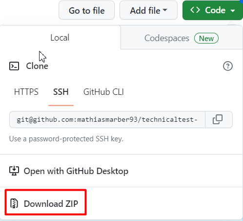

3. Open Intellij IDEA and open the project

   - File / Open /
   - Navigate to the path where you have cloned or downloaded the project
   - Double click to the project
   
   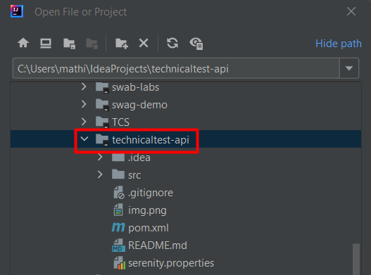
   

4. Install project dependencies:

- Go to Maven Window / Execute Maven Goals / Execute the following command:
   
 ```bash
   mvn clean install -DskipTests 
   ```
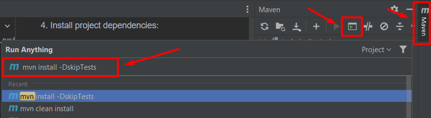

5. Install Gherkin and Cucumber for Java in Marketplace
- In Intellij IDEA, go to File / Settings / Plugins / Marketplace
- Type Gherkin and install
- Type Cucumber for Java and install

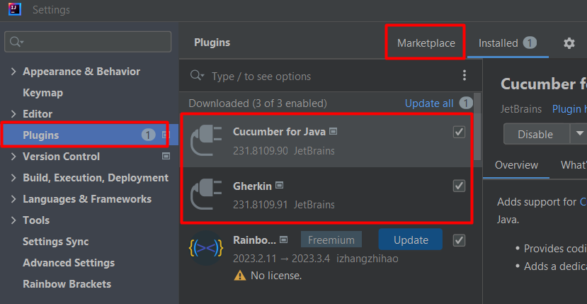!

6. Generate the API Key in the following link: https://countrylayer.com/documentation
- Click on Login
- Click on Get your API Key Free
- Click again on the option Get free API Key
- Fill the account details and the billing details
- Once the account is created, click on Visit Dashboard
- Type the email and password created
- Copy the API Key
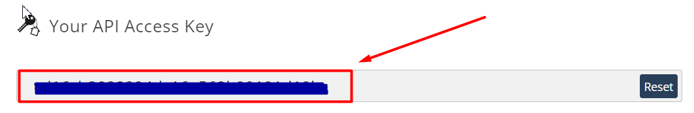
- Go to Intellij IDEA, open the ```serenity.properties``` and paste the API Key in the  ```api.key ``` property
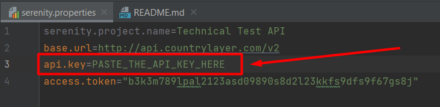

## Project Structure
- `src/test/java`: Contains test automation code.
- `src/test/resources`: Contains feature file.
- `serenity.properties`: Configuration file for Serenity BDD properties.
- `pom.xml`: Maven project configuration file.

## Running Tests
To run the tests, go to Maven Window / click on Execute Maven Goals and type:
```bash
mvn clean verify
```
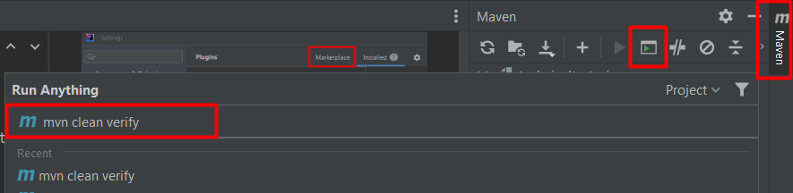

There will be an error with the last test because it is about the POST Method that is not developed yet.
And sometimes the GET requests will fail because the API has a rate limiting (code 429), so be careful not to exceed the rate limiting. Otherwise, create a random account

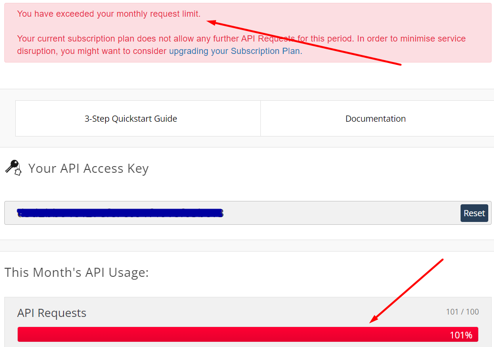

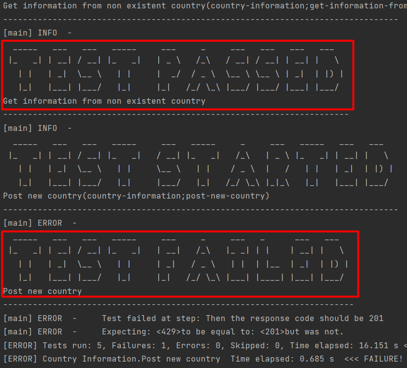

## Reporting
After running tests, go to Maven Window, click on Execute Maven Goals and type
```bash
mvn serenity:aggregate
```
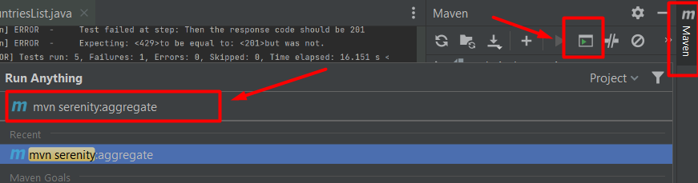

Open the index HTML report to view detailed test results and statistics.

In the report, in the GET requests result sections, there will be several GET requests because of the code 429, so this project has a java class called RetryTime.java that consists of repeating the HTTP request until getting the wanted status code (200 for existing countries and 404 for non-existing countries)
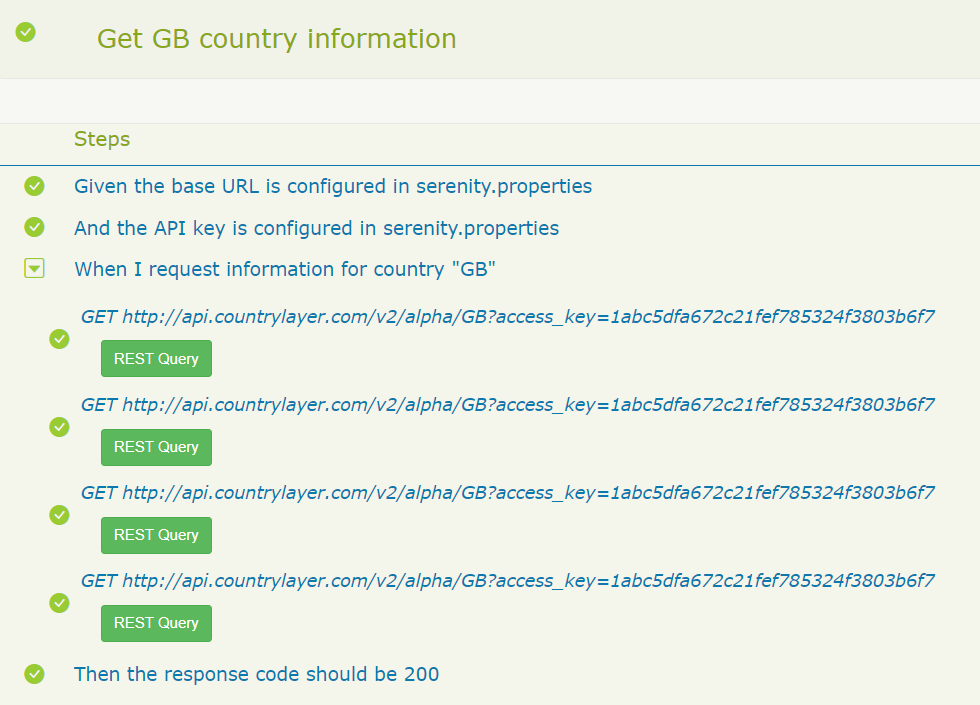

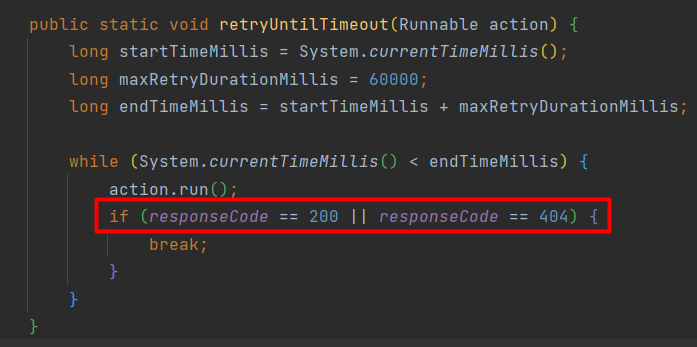

You can also refer my serenity report for the technical test API generated 09-17-2023 20:46 in the following link:
https://mathiasmarber93.github.io/technicaltest-api-report/